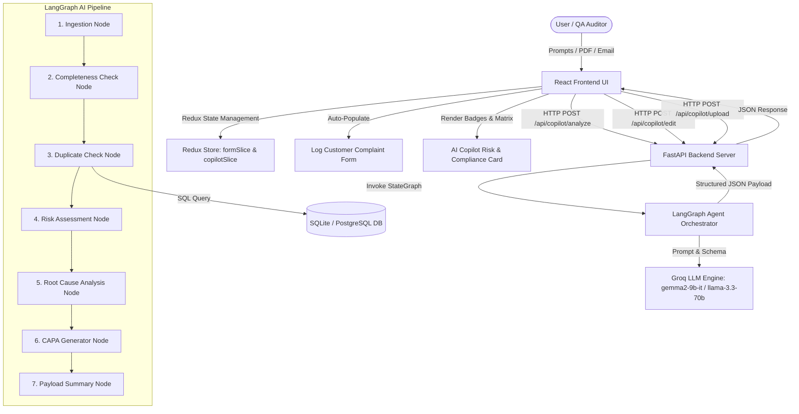
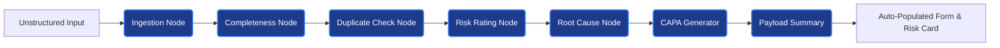

# AIVOA – AI-Powered Customer Complaint Management System (Pharma QMS)

[](https://github.com/Rishisharma029)
[](https://python.org)
[](https://fastapi.tiangolo.com)
[](https://react.dev)
[](https://redux-toolkit.js.org)
[](https://langchain.com)
[](https://console.groq.com)
[](https://fda.gov)
[](LICENSE)

An enterprise-grade, AI-powered Quality Management System (QMS) Customer Complaint module specifically designed for the **Pharmaceutical Manufacturing Industry** (Active Pharmaceutical Ingredients - **API** & Finished Dosage Forms - **FDF**).

---

## Executive Overview & Pharma QMS Context

In pharmaceutical manufacturing, Customer Complaint Management is a critical regulatory requirement under **21 CFR Part 211.198** and **EU GMP Annex 13/15**. The system must:
1. Document quality defects accurately.
2. Perform **ICH Q9 Quality Risk Management (QRM)** to classify risk levels.
3. Conduct **Root Cause Analysis (RCA)** using 5-Whys and 6-M Ishikawa (Fishbone) models.
4. Flag mandatory **FDA 3-Day Field Alert Reports (FAR)** or EMA Rapid Alerts for critical product quality defects.
5. Formulate **Corrective and Preventive Action (CAPA)** plans.

This application pairs an interactive React UI (managed via Redux Toolkit) with a FastAPI backend powered by a **LangGraph Multi-Node AI Agent** and **Groq LLM (`gemma2-9b-it`)**.

---

## System Architecture & Data Flow



---

## LangGraph Multi-Node State Graph Execution



---

## Key Features & 3 Mandatory AI Tools

### 1. 📝 Log Complaint Tool (ChatGPT-Style Prompt Processing)
- Processes natural language prompts (e.g. *"Complaint received July 20, 2026 from Dr. Sarah Williams at City Central Hospital for Paracetamol 500mg Tablets Batch B-9941..."*).
- Extracts structured entities (*Product Name, Dosage Form, Batch Number, Manufacturing/Expiry Dates, Defect Category, Description, Reporter Info, Quantity Affected*).
- Performs AI reasoning to populate the risk assessment section (*Severity 1-5, Likelihood 1-5, Risk Level, Regulatory Alert*).

### 2. ✏️ Edit Complaint Tool (Natural Language Form Updates)
- Modifies form inputs via natural language (e.g. *"Change batch number to B-9952 and escalate severity to Critical because 3 patients had adverse reactions"*).
- **Strict Data Preservation**: Updates only the requested fields while strictly preserving all existing customer complaint fields.

### 3. 📄 Document Extraction Tool (PDF & Email Parsing)
- Parses uploaded customer complaint PDFs, email transcripts (`.eml`, `.txt`), or pre-packaged realistic pharma samples (*Paracetamol Tablet Chipping B-9941*, *Amoxicillin API OOS Impurity A-4022*, *Metformin Packaging Leak M-7712*).

---

## All 6 Bonus Features Implemented

| Bonus Feature | Description | Implementation Location |
| :--- | :--- | :--- |
| **1. Complaint Completeness Checker** | Evaluates mandatory QMS audit fields (`product_name`, `batch_number`, `quantity_affected`, `date_received`, `reporter_name`, `defect_description`). Calculates percentage score (0–100%) and highlights missing fields in red with `(Missing)` tags. | [`graph.py` (Node 2)](backend/app/ai/graph.py) & [`RiskAssessmentCard.jsx`](frontend/src/components/RiskAssessmentCard.jsx) |
| **2. Root Cause Recommendation** | Generates a 5-step **5-Whys** progressive deduction tree and a **6-M Ishikawa (Fishbone)** diagram (*Man, Machine, Material, Method, Measurement, Environment*). | [`graph.py` (Node 5)](backend/app/ai/graph.py) & [`RCACapaViewer.jsx`](frontend/src/components/RCACapaViewer.jsx) |
| **3. Duplicate Complaint Detection** | Queries historical SQL database by batch number and product line to flag duplicate complaints with similarity reasons. | [`graph.py` (Node 3)](backend/app/ai/graph.py) & [`DuplicateDetectionCard.jsx`](frontend/src/components/DuplicateDetectionCard.jsx) |
| **4. CAPA Recommendation** | Formulates a 3-part Action Plan: **Containment** (quarantine & stock hold), **Corrective** (tooling & batch fix), and **Preventive** (SOP updates). | [`graph.py` (Node 6)](backend/app/ai/graph.py) & [`RCACapaViewer.jsx`](frontend/src/components/RCACapaViewer.jsx) |
| **5. Complaint Summary** | Synthesizes an executive QMS narrative summary covering product, batch, risk rating, root cause, and compliance status. | [`graph.py` (Node 7)](backend/app/ai/graph.py) & Copilot Stream |
| **6. AI Risk Classification** | Performs ICH Q9 Quality Risk Assessment: Severity (1–5) × Likelihood (1–5) = Risk Score, classifies Risk Level (*Critical, Major, Medium, Low*), and flags **FDA 3-Day Field Alert Reports (FAR)**. | [`graph.py` (Node 4)](backend/app/ai/graph.py) & [`RiskAssessmentCard.jsx`](frontend/src/components/RiskAssessmentCard.jsx) |

---

## Technology Stack

- **Frontend**: React 18, `@reduxjs/toolkit`, `react-redux`, Lucide Icons, Google Inter Font.
- **Backend**: Python 3.10+, FastAPI, Uvicorn, Pydantic v2, SQLAlchemy.
- **AI Framework**: LangGraph (`StateGraph`).
- **LLM Engine**: Groq API (`gemma2-9b-it` / `llama-3.3-70b-versatile`).
- **Database**: SQLite (default `complaints.db`) & PostgreSQL ready.

---

## Quick Start & Execution Guide

### Option 1: One-Click Execution (Windows)
Run `run_all.bat` from the repository root:
```cmd
run_all.bat
```

### Option 2: Manual Setup

#### 1. Launch FastAPI Backend
```bash
cd backend
python -m venv venv
# Windows:
.\venv\Scripts\activate
# Linux/macOS:
source venv/bin/activate

pip install -r requirements.txt

# (Optional) Add your Groq API Token in backend/.env:
# GROQ_API_KEY=gsk_...
# GROQ_MODEL=gemma2-9b-it

python -m uvicorn app.main:app --reload --port 8000
```
Backend API interactive documentation: `http://localhost:8000/docs`

#### 2. Launch React Frontend
```bash
cd frontend
npm install
npm run dev
```
Frontend UI running at: `http://localhost:5173`

---

## API Reference Documentation

| Method | Endpoint | Description |
| :--- | :--- | :--- |
| `POST` | `/api/copilot/analyze` | Executes LangGraph state graph workflow on raw prompt text or sample ID. |
| `POST` | `/api/copilot/edit` | Modifies existing complaint form inputs using natural language edit instructions. |
| `POST` | `/api/copilot/upload` | Parses uploaded `.pdf` or `.eml` files and populates complaint form & risk card. |
| `GET` | `/api/complaints` | Returns list of stored QMS customer complaints with search and filter parameters. |
| `POST` | `/api/complaints` | Persists a new complaint into SQLite/PostgreSQL DB with 21 CFR Part 11 Audit Trail. |
| `GET` | `/api/complaints/analytics/kpis` | Returns executive QMS analytics metrics (Total, Critical, FDA Alerts, Defect pareto). |

---

## Project Structure

```
├── .github/
│   └── workflows/
│       └── ci.yml               # GitHub Actions CI workflow
├── backend/
│   ├── app/
│   │   ├── ai/
│   │   │   ├── graph.py         # LangGraph state graph nodes
│   │   │   └── llm.py           # Groq LLM client wrapper
│   │   ├── routers/
│   │   │   ├── complaints.py    # CRUD & QMS analytics endpoints
│   │   │   └── copilot.py       # AI Copilot workflow trigger & document parser
│   │   ├── config.py            # Environment settings
│   │   ├── database.py          # SQLAlchemy database engine
│   │   ├── models.py            # SQLAlchemy models
│   │   ├── schemas.py           # Pydantic schemas
│   │   └── main.py              # FastAPI app & DB seeder
│   ├── requirements.txt
│   └── .env.example
├── frontend/
│   ├── src/
│   │   ├── components/
│   │   │   ├── Navbar.jsx
│   │   │   ├── IngestionPanel.jsx
│   │   │   ├── LangGraphVisualizer.jsx
│   │   │   ├── ComplaintForm.jsx
│   │   │   ├── RiskAssessmentCard.jsx
│   │   │   ├── DuplicateDetectionCard.jsx
│   │   │   ├── RCACapaViewer.jsx
│   │   │   ├── CopilotAssistant.jsx
│   │   │   ├── ComplaintsList.jsx
│   │   │   └── AnalyticsDashboard.jsx
│   │   ├── store/
│   │   │   ├── index.js
│   │   │   ├── copilotSlice.js
│   │   │   ├── formSlice.js
│   │   │   └── complaintSlice.js
│   │   ├── App.jsx
│   │   └── index.css
│   ├── package.json
│   └── vite.config.js
├── .gitignore
├── LICENSE
├── CODE_OF_CONDUCT.md
├── SECURITY.md
├── run_all.bat
└── README.md
```

---

## Compliance & Security

- **21 CFR Part 211 Compliance**: Audit trail logging for all QMS complaint intake and status changes.
- **Security Policy**: See [`SECURITY.md`](SECURITY.md) for vulnerability disclosure details.
- **Code of Conduct**: See [`CODE_OF_CONDUCT.md`](CODE_OF_CONDUCT.md) for community standards.
- **License**: Released under the [MIT License](LICENSE).
